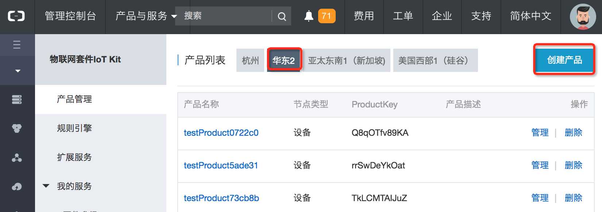
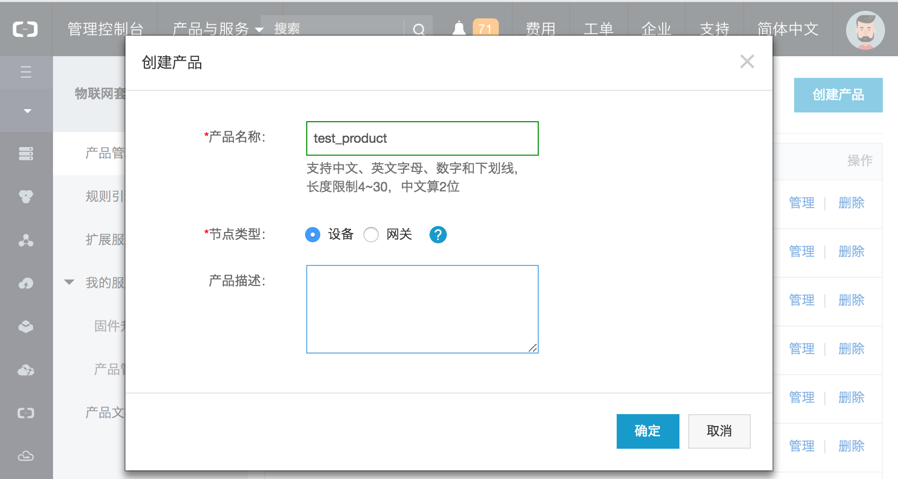
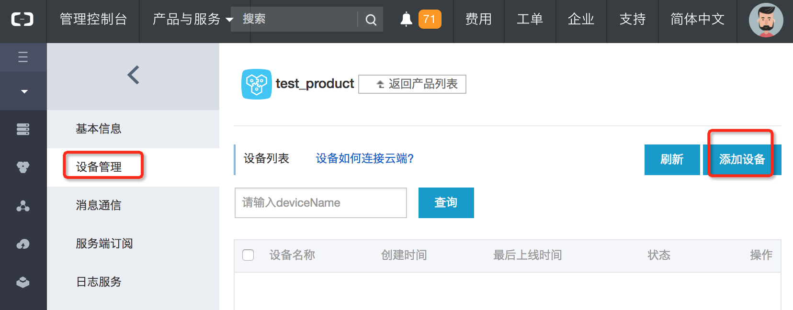
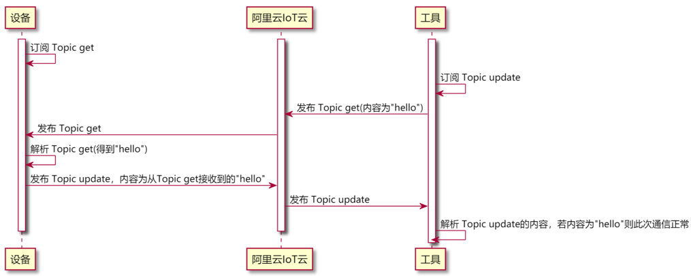
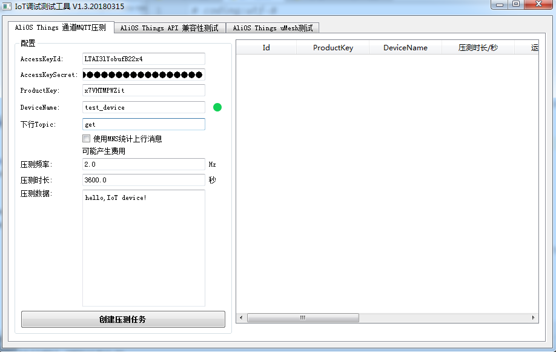
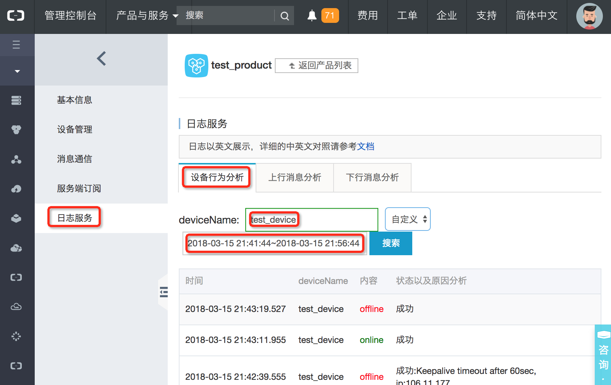
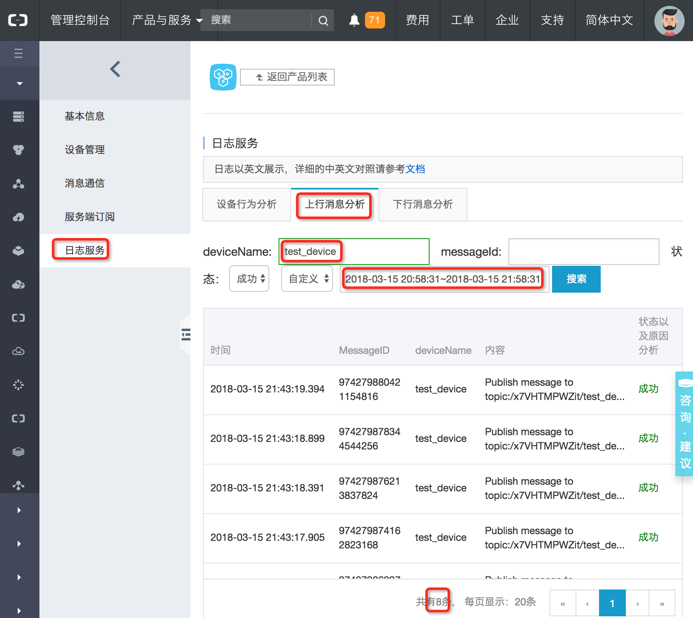
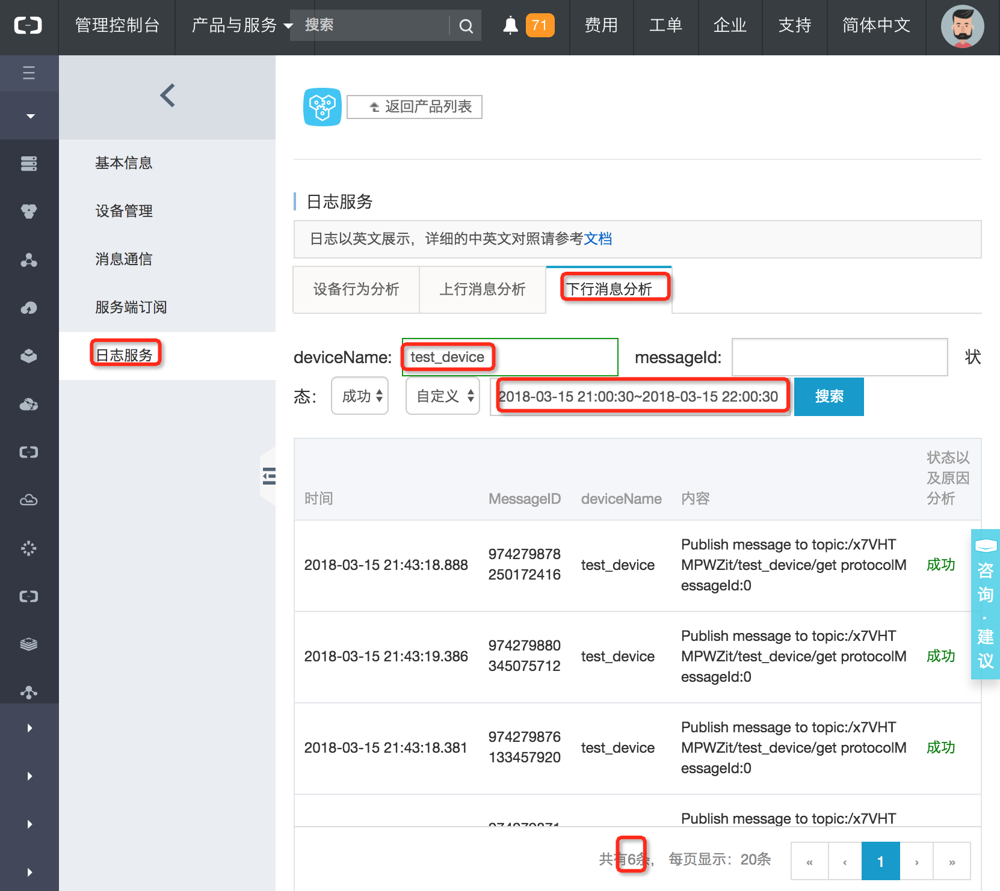

# AliOS Things MQTT 通道自测指南
进行MQTT通道测试前，需要准备阿里云账号并在阿里云物联网套件平台创建测试设备，详细准备工作见下文。

## 准备工作
### 准备阿里云账号
1. 阿里云物联网套件平台使用阿里云账号登录，在测试前若无阿里云账号请首先[注册](https://www.aliyun.com/)阿里云账号
2. 在阿里云账号下创建accessKeys <https://ak-console.aliyun.com/#/accesskey>
>accessKey是访问阿里云API的密钥，务必妥善保管，若accessKey已经存在则无需再创建
### 创建测试设备
登录[阿里云物联网套件](iot.console.aliyun.com)网站，在华东2区域中创建测试产品和测试设备，并保存测试设备的三元组（ProductKey、DeviceName、DeviceSecret）

### 下载测试工具
[IoT调试测试工具](http://alios-things.oss-cn-shanghai.aliyuncs.com/AliOSThings/IoT%E8%B0%83%E8%AF%95%E6%B5%8B%E8%AF%95%E5%B7%A5%E5%85%B7.exe)是用于向指定设备长时间周期性发送数据的桌面工具，在通道压测中使用。
> 下载地址：http://alios-things.oss-cn-shanghai.aliyuncs.com/AliOSThings/IoT%E8%B0%83%E8%AF%95%E6%B5%8B%E8%AF%95%E5%B7%A5%E5%85%B7.exe
## MQTT通道压测
通道压测的基本原理如下图：

设备端需要订阅get主题，在get主题回调函数中将接收到的消息原封不动发布到update主题，工具统计定时发布消息并接收来自设备的消息。
### 操作步骤
为了配合工具使用，需要对设备代码做部分适配，详细操作步骤如下：
1. 从GitHub[下载AliOS Things源码](https://github.com/alibaba/AliOS-Things.git)，`{SOURCE_ROOT}/example/mqttapp`目录是MQTT的基本用法
2. 编译Linux平台下的虚拟设备，用于验证工具和设备代码符合预期：`aos make mqttapp@linuxhost`
3. 在Linux平台下执行可执行程序：`./out/mqttapp@linuxhost/binary/mqtt@linuxhost.elf`
4. 启动IoT调试测试工具，填写账号参数、设备参数和压测参数，创建压测任务

   > 1. 正确填写AccessKeyId、AccessKeySecret、ProductKey、DeviceName后，若设备在线则会显示绿色的亮点
5. 在查看Linux下查看虚拟设备日志打印，若显示如下日志表示压测任务创建成功

6. 编译目标平台下的真实固件，并在硬件测试：`aos make mqttapp@{board}`
### 日志查询
压测过程中设备是否出现离线、是否存在丢包，可以通过日志系统准确的查询出来
#### 离线查询

#### 设备上行消息数量查询

#### 设备下行消息数量查询

## MQTT通道稳定性测试
MQTT通道稳定性测试通常需要将设备长时间挂机，例如，5x24小时，保持设备所处网络环境稳定，待长时间挂机结束后通过日志查询设备在稳定性挂机期间是否有离线的情况
> 测试过程中建议完整保存设备日志，并通过工具对设备端日志打上时间戳，便于在出现离线时快速准确判断设备行为
## MQTT通过功能测试